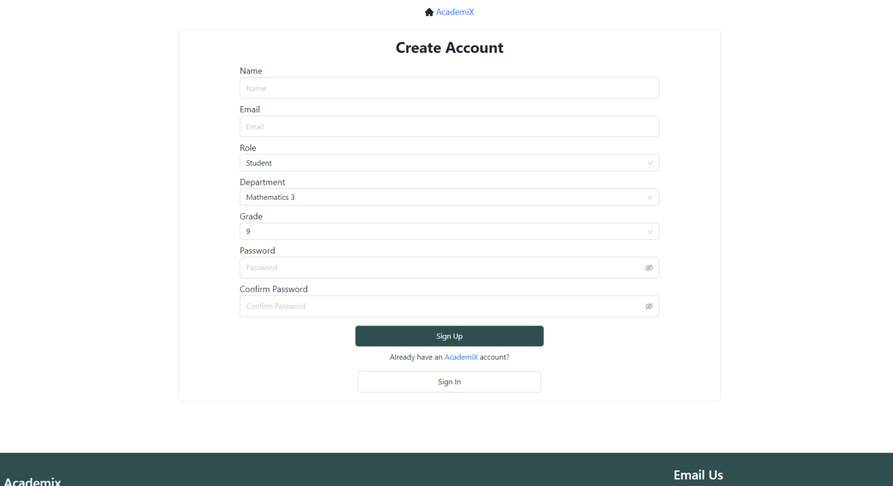

AcademiX is a Learning Management Sytem (LMS) project built with Frontend technologies like React js, Redux, Antd and Bootstrap, and backend technologies like Nodejs, ExpressJs and MongoDB. It has administrator functionalities like department, course and user registration and management. Instructors use the system to get and manage their courses as well as lessons. Students can access their courses and lessons and track their activities. It has all the important functionalities like user account management, email integrations and secure data handling.

Below are some screen images of the system :

Landing Page

Sign Up Page

Log in Page

Recover Account Page

Admin Page

Teacher Page

Student Page

